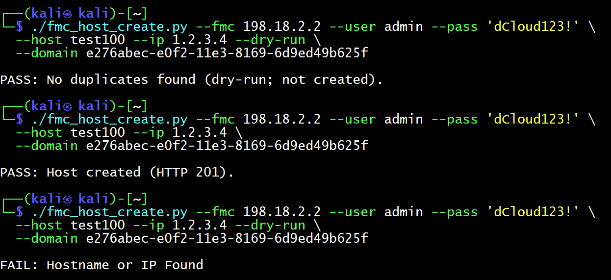

# Using pythong script and manual entry

## Walkthrough of the script, section by section

1) Shebang, docstring, and high-level overview
```python
#!/usr/bin/env python3
"""
FMC Host create with duplicate check + clear PASS/FAIL.
Now supports:
  --domain <UUID>           (explicit)
  --domain-name "Global"    (pick by name)
  --debug                   (print domains + chosen UUID)

Exit codes:
  0 = PASS (created or dry-run OK)
  3 = FAIL (duplicate found: name or IP)
  2 = FAIL (HTTP/API/other error)
"""
```

Shebang lets you run it as ./fmc_host_create.py.

Docstring is the script’s manual: what it does, flags, and exit codes (handy for CI).
<br><br>


2) Imports and TLS warning handling
```python
import argparse, json, sys
from typing import Tuple, List, Dict, Optional
import requests, urllib3
urllib3.disable_warnings(urllib3.exceptions.InsecureRequestWarning)
```
argparse: parses command-line flags (e.g., --fmc, --host).
requests: makes HTTPS calls to FMC.
typing: type hints (helps readability & tooling).
urllib3.disable_warnings(...): suppresses TLS warnings because we use verify=False (lab/self-signed certs). In production, you’d install the cert and remove that line.
<br><br>


3) Utility helpers
```python
def echo_status(status: str, message: str):
    print(f"{status}: {message}")
```

Prints a single line like PASS: ... or FAIL: ....
Easy for humans and CI pipelines to parse.

```python
def write_json_out(path: str, payload: dict):
    try:
        with open(path, "w") as f:
            json.dump(payload, f, indent=2)
    except Exception as e:
        print(f"WARNING: could not write json-out file: {e}", file=sys.stderr)
```

Optional: writes a summary file when you pass --json-out result.json. Great for logging or dashboards.
<br><br>


4) Authentication: get_token
```python
def get_token(fmc: str, user: str, pw: str) -> Tuple[str, Optional[str]]:
    url = f"https://{fmc}/api/fmc_platform/v1/auth/generatetoken"
    r = requests.post(url, auth=(user, pw), headers={"Accept":"application/json"}, verify=False)
    if r.status_code not in (200, 201, 204):
        raise RuntimeError(f"Token request failed: {r.status_code} {r.text}")

    access = r.headers.get("X-auth-access-token")
    refresh = r.headers.get("X-auth-refresh-token")
    if not access:
        raise RuntimeError(f"No X-auth-access-token header. Status {r.status_code} Headers {dict(r.headers)}")
    return access, refresh
```

Calls /auth/generatetoken with Basic Auth (username/password).
Accepts 200/201/204 because many FMCs return 204 No Content with tokens only in headers.
Extracts Access token (required) and Refresh token (may be missing on some setups).
Raises a clear error if the access token header is missing.
<br><br>


5) Domain discovery: list_domains and choose_domain
```python
def list_domains(fmc: str, token: str) -> List[Dict]:
    url = f"https://{fmc}/api/fmc_platform/v1/info/domain"
    r = requests.get(url, headers={"X-auth-access-token": token, "Accept":"application/json"}, verify=False)
    if r.status_code != 200:
        raise RuntimeError(f"Domain list failed: {r.status_code} {r.text}")
    return r.json().get("items", [])
```

Uses your access token to list domains (e.g., Global).
Returns an array of domain objects; each has name and id (UUID).

```python
def choose_domain(domains: List[Dict], want_name: Optional[str], debug: bool=False) -> str:
    if debug:
        print("[DEBUG] Domains payload:")
        print(json.dumps(domains, indent=2))
    if want_name:
        for d in domains:
            if d.get("name","").strip().lower() == want_name.strip().lower():
                if d.get("id"):
                    if debug: print(f"[DEBUG] Chosen by name: {d.get('name')} -> {d.get('id')}")
                    return d["id"]
        raise RuntimeError(f"Domain named '{want_name}' not found or missing id.")
    # fallback: first domain with an id
    for d in domains:
        if d.get("id"):
            if debug: print(f"[DEBUG] Chosen first domain: {d.get('name')} -> {d.get('id')}")
            return d["id"]
    raise RuntimeError("No domain with a valid 'id' found.")
```

If you pass --domain-name "Global", it picks by friendly name (case-insensitive).
Else, it picks the first domain with an id.
--debug prints the selection process (useful when learning).
Why do we care? All config endpoints require a domain UUID in the path.
<br><br>

6) Reading objects with pagination: fetch_all_hosts
```python
def fetch_all_hosts(fmc: str, token: str, domain_uuid: str, limit: int = 1000) -> List[Dict]:
    if not domain_uuid:
        raise RuntimeError("Domain UUID is empty. Provide --domain or --domain-name.")
    all_items, offset = [], 0
    while True:
        url = f"https://{fmc}/api/fmc_config/v1/domain/{domain_uuid}/object/hosts?limit={limit}&offset={offset}&expanded=true"
        r = requests.get(url, headers={"X-auth-access-token": token, "Accept":"application/json"}, verify=False)
        if r.status_code == 401:
            raise RuntimeError("401 Unauthorized while fetching hosts (token expired/invalid).")
        if r.status_code != 200:
            raise RuntimeError(f"Fetch hosts failed: {r.status_code} {r.text}")
        js = r.json()
        items = js.get("items", []) or []
        if not items:
            break
        all_items.extend(items)
        offset += len(items)
        if len(items) < limit:
            break
    return all_items
```

FMC paginates results. We loop using limit/offset until there are no more items.
Collects everything into all_items so we can do complete duplicate checks.
If token expires mid-way, you’ll see the 401 guard (we can add auto-refresh later if you want).
<br><br>


7) Creating a Host object: create_host
```python
def create_host(fmc: str, token: str, domain_uuid: str, name: str, ip: str) -> requests.Response:
    url = f"https://{fmc}/api/fmc_config/v1/domain/{domain_uuid}/object/hosts"
    payload = {"type":"Host","name":name,"value":ip,"overridable":False,"description":"Created via automation script"}
    return requests.post(url, headers={
        "X-auth-access-token": token, "Accept":"application/json", "Content-Type":"application/json"
    }, verify=False, json=payload)
```

Builds the Host payload (type/name/value/description).
Sends a POST to create it.
Returns the raw Response so callers can read status_code and body.
<br><br>


8) main() — glue logic, flags, and exit codes
```python
def main():
    ap = argparse.ArgumentParser()
    ap.add_argument("--fmc", required=True, help="FMC IP/hostname (e.g. 198.18.2.2)")
    ap.add_argument("--user", required=True)
    ap.add_argument("--pass", required=True, dest="pw")
    ap.add_argument("--host", required=True, help="New host NAME")
    ap.add_argument("--ip", required=True, help="New host IP")
    ap.add_argument("--domain", help="Domain UUID (preferred if you know it)")
    ap.add_argument("--domain-name", help="Pick domain by name (e.g., 'Global')")
    ap.add_argument("--dry-run", action="store_true", help="Check only; do not create")
    ap.add_argument("--json-out", help="Write summary JSON here")
    ap.add_argument("--debug", action="store_true", help="Print debug info")
    args = ap.parse_args()
```

Defines the CLI interface.
Examples:
explicit UUID: --domain e276...
by name: --domain-name "Global"
non-destructive check: --dry-run
structured output: --json-out result.json
verbose selection: --debug

```python
    summary = {
        "action":"create_host","fmc":args.fmc,
        "host_name":args.host,"host_ip":args.ip,
        "domain_uuid":args.domain or "",
        "domain_name":args.domain_name or "",
        "dry_run":bool(args.dry_run),
        "result":"","http_status":None,"details":{}
    }
```

Accumulates a machine-readable summary (useful in pipelines or for logging).

```python
    try:
        token, refresh = get_token(args.fmc, args.user, args.pw)
```

Login (get tokens). If it fails, the except prints a FAIL and exits with code 2.
```python
        domain_uuid = args.domain
        if not domain_uuid:
            domains = list_domains(args.fmc, token)
            if not domains:
                raise RuntimeError("No domains returned by FMC.")
            domain_uuid = choose_domain(domains, args.domain_name, debug=args.debug)
        summary["domain_uuid"] = domain_uuid
```

If you didn’t provide --domain, we fetch and select one (by name or first available).

```python
        hosts = fetch_all_hosts(args.fmc, token, domain_uuid)
        summary["details"]["hosts_fetched"] = len(hosts)

        names_lc = {(h.get("name","").strip().lower()):h for h in hosts if h.get("name")}
        ips = {h.get("value"):h for h in hosts if h.get("value")}
```

Fetches all Hosts, then builds two fast lookup maps:
names_lc: key is lowercase name → object
ips: key is exact IP string → object

```python
        name_exists = args.host.strip().lower() in names_lc
        ip_exists = args.ip.strip() in ips
        if name_exists or ip_exists:
            summary["result"] = "duplicate"
            summary["http_status"] = 409
            summary["details"].update({
                "name_exists": bool(name_exists),
                "ip_exists": bool(ip_exists),
                "existing_name_obj": names_lc.get(args.host.strip().lower()),
                "existing_ip_obj": ips.get(args.ip.strip())
            })
            echo_status("FAIL", "Hostname or IP Found")
            if args.json_out: write_json_out(args.json_out, summary)
            sys.exit(3)
```

Duplicate checks:
Name check is case-insensitive.
IP check is exact match.
On duplicate: prints FAIL, exits with 3, and stores details in JSON if requested.

```python
        if args.dry_run:
            summary["result"] = "dry_run_ok"
            summary["http_status"] = 200
            echo_status("PASS", "No duplicates found (dry-run; not created).")
            if args.json_out: write_json_out(args.json_out, summary)
            sys.exit(0)
```

Dry-run mode: confirms you’re safe to create, but doesn’t call the POST.

```python
        resp = create_host(args.fmc, token, domain_uuid, args.host.strip(), args.ip.strip())
        summary["http_status"] = resp.status_code

        if resp.status_code in (200, 201):
            summary["result"] = "created"
            try: summary["details"]["response"] = resp.json()
            except Exception: summary["details"]["response_raw"] = resp.text
            echo_status("PASS", f"Host created (HTTP {resp.status_code}).")
            if args.json_out: write_json_out(args.json_out, summary)
            sys.exit(0)
```

Create the host for real.
Treats 200/201 as success, prints PASS, exits 0.
Saves the server’s response to your summary for auditing.

```python
        summary["result"] = "error"
        try: summary["details"]["response"] = resp.json()
        except Exception: summary["details"]["response_raw"] = resp.text
        echo_status("FAIL", f"Creation failed (HTTP {resp.status_code}).")
        if args.json_out: write_json_out(args.json_out, summary)
        sys.exit(2)
```

Any other status (e.g., 400/401/409) → FAIL with exit 2 (generic error).

```python
    except Exception as e:
        summary["result"] = "error"
        summary["details"] = {"exception": str(e)}
        echo_status("FAIL", str(e))
        if args.json_out: write_json_out(args.json_out, summary)
        sys.exit(2)
```

Top-level safety net: prints a clean error and exits 2.
<br><br>


9) Why the exit codes matter

0: success (created or dry-run passed). Shell example:

```python
if ./fmc_host_create.py ...; then echo OK; fi
```

3: duplicate (expected business case). You can handle it differently:

```python
./fmc_host_create.py ... ; rc=$?
if [ $rc -eq 3 ]; then echo "Duplicate—skip"; fi
```
2: real error (network, 401, bad input).
<br><br>


10) Common extensions (easy to add later)

Auto token refresh: on a 401 during host fetch, call /auth/refreshtoken with current tokens and retry.
Update instead of create: if name exists but IP differs, offer --update-if-exists.
Delete: add a subcommand delete --host NAME (calls DELETE with the object’s id).
<br><br>

11) Security notes

In labs we use verify=False. In prod, install the FMC CA or server cert and set verify=True.
Avoid storing passwords in shell history; consider reading from env vars or prompting.
<br><br>

12) Quick run examples (recap)
Dry-run (no create):

```bash
./fmc_host_create.py --fmc 198.18.2.2 --user admin --pass 'dCloud123!' \
  --host test100 --ip 1.2.3.4 --dry-run --domain e276abec-e0f2-11e3-8169-6d9ed49b625f
```

Create for real:

```bash
./fmc_host_create.py --fmc 198.18.2.2 --user admin --pass 'dCloud123!' \
  --host test100 --ip 1.2.3.4 --domain e276abec-e0f2-11e3-8169-6d9ed49b625f
```

Pick by name (if you don’t know the UUID):

```bash
./fmc_host_create.py --fmc 198.18.2.2 --user admin --pass 'dCloud123!' \
  --host test100 --ip 1.2.3.4 --domain-name "Global" --dry-run --debug
```

If you want, I can add auto-refresh and a --update-if-exists path next, so duplicates can optionally update the IP instead of failing.
<br><br>

## Full Script

fmc_host_create.py

```python
#!/usr/bin/env python3
"""
FMC Host create with duplicate check + clear PASS/FAIL.
Now supports:
  --domain <UUID>           (explicit)
  --domain-name "Global"    (pick by name)
  --debug                   (print domains + chosen UUID)

Exit codes:
  0 = PASS (created or dry-run OK)
  3 = FAIL (duplicate found: name or IP)
  2 = FAIL (HTTP/API/other error)
"""

import argparse, json, sys
from typing import Tuple, List, Dict, Optional
import requests, urllib3
urllib3.disable_warnings(urllib3.exceptions.InsecureRequestWarning)

def echo_status(status: str, message: str):
    print(f"{status}: {message}")

def write_json_out(path: str, payload: dict):
    try:
        with open(path, "w") as f:
            json.dump(payload, f, indent=2)
    except Exception as e:
        print(f"WARNING: could not write json-out file: {e}", file=sys.stderr)

def get_token(fmc: str, user: str, pw: str) -> Tuple[str, Optional[str]]:
    url = f"https://{fmc}/api/fmc_platform/v1/auth/generatetoken"
    r = requests.post(url, auth=(user, pw), headers={"Accept":"application/json"}, verify=False)
    if r.status_code not in (200, 201, 204):
        raise RuntimeError(f"Token request failed: {r.status_code} {r.text}")
    access = r.headers.get("X-auth-access-token")
    refresh = r.headers.get("X-auth-refresh-token")
    if not access:
        raise RuntimeError(f"No X-auth-access-token header. Status {r.status_code} Headers {dict(r.headers)}")
    return access, refresh

def list_domains(fmc: str, token: str) -> List[Dict]:
    url = f"https://{fmc}/api/fmc_platform/v1/info/domain"
    r = requests.get(url, headers={"X-auth-access-token": token, "Accept":"application/json"}, verify=False)
    if r.status_code != 200:
        raise RuntimeError(f"Domain list failed: {r.status_code} {r.text}")
    return r.json().get("items", [])

def choose_domain(domains: List[Dict], want_name: Optional[str], debug: bool=False) -> str:
    if debug:
        print("[DEBUG] Domains payload:")
        print(json.dumps(domains, indent=2))
    if want_name:
        for d in domains:
            if d.get("name","").strip().lower() == want_name.strip().lower():
                if d.get("id"):
                    if debug:
                        print(f"[DEBUG] Chosen by name: {d.get('name')} -> {d.get('id')}")
                    return d["id"]
        raise RuntimeError(f"Domain named '{want_name}' not found or missing id.")
    # fallback: first domain with an id
    for d in domains:
        if d.get("id"):
            if debug:
                print(f"[DEBUG] Chosen first domain: {d.get('name')} -> {d.get('id')}")
            return d["id"]
    raise RuntimeError("No domain with a valid 'id' found.")

def fetch_all_hosts(fmc: str, token: str, domain_uuid: str, limit: int = 1000) -> List[Dict]:
    if not domain_uuid:
        raise RuntimeError("Domain UUID is empty. Provide --domain or --domain-name.")
    all_items, offset = [], 0
    while True:
        url = f"https://{fmc}/api/fmc_config/v1/domain/{domain_uuid}/object/hosts?limit={limit}&offset={offset}&expanded=true"
        r = requests.get(url, headers={"X-auth-access-token": token, "Accept":"application/json"}, verify=False)
        if r.status_code == 401:
            raise RuntimeError("401 Unauthorized while fetching hosts (token expired/invalid).")
        if r.status_code != 200:
            raise RuntimeError(f"Fetch hosts failed: {r.status_code} {r.text}")
        js = r.json()
        items = js.get("items", []) or []
        if not items:
            break
        all_items.extend(items)
        offset += len(items)
        if len(items) < limit:
            break
    return all_items

def create_host(fmc: str, token: str, domain_uuid: str, name: str, ip: str) -> requests.Response:
    url = f"https://{fmc}/api/fmc_config/v1/domain/{domain_uuid}/object/hosts"
    payload = {"type":"Host","name":name,"value":ip,"overridable":False,"description":"Created via automation script"}
    return requests.post(url, headers={
        "X-auth-access-token": token, "Accept":"application/json", "Content-Type":"application/json"
    }, verify=False, json=payload)

def main():
    ap = argparse.ArgumentParser()
    ap.add_argument("--fmc", required=True, help="FMC IP/hostname (e.g. 198.18.2.2)")
    ap.add_argument("--user", required=True)
    ap.add_argument("--pass", required=True, dest="pw")
    ap.add_argument("--host", required=True, help="New host NAME")
    ap.add_argument("--ip", required=True, help="New host IP")
    ap.add_argument("--domain", help="Domain UUID (preferred if you know it)")
    ap.add_argument("--domain-name", help="Pick domain by name (e.g., 'Global')")
    ap.add_argument("--dry-run", action="store_true", help="Check only; do not create")
    ap.add_argument("--json-out", help="Write summary JSON here")
    ap.add_argument("--debug", action="store_true", help="Print debug info")
    args = ap.parse_args()

    summary = {
        "action":"create_host","fmc":args.fmc,
        "host_name":args.host,"host_ip":args.ip,
        "domain_uuid":args.domain or "",
        "domain_name":args.domain_name or "",
        "dry_run":bool(args.dry_run),
        "result":"","http_status":None,"details":{}
    }

    try:
        token, refresh = get_token(args.fmc, args.user, args.pw)

        domain_uuid = args.domain
        if not domain_uuid:
            domains = list_domains(args.fmc, token)
            if not domains:
                raise RuntimeError("No domains returned by FMC.")
            domain_uuid = choose_domain(domains, args.domain_name, debug=args.debug)
        summary["domain_uuid"] = domain_uuid

        hosts = fetch_all_hosts(args.fmc, token, domain_uuid)
        summary["details"]["hosts_fetched"] = len(hosts)

        names_lc = {(h.get("name","").strip().lower()):h for h in hosts if h.get("name")}
        ips = {h.get("value"):h for h in hosts if h.get("value")}

        name_exists = args.host.strip().lower() in names_lc
        ip_exists = args.ip.strip() in ips
        if name_exists or ip_exists:
            summary["result"] = "duplicate"
            summary["http_status"] = 409
            summary["details"].update({
                "name_exists": bool(name_exists),
                "ip_exists": bool(ip_exists),
                "existing_name_obj": names_lc.get(args.host.strip().lower()),
                "existing_ip_obj": ips.get(args.ip.strip())
            })
            echo_status("FAIL", "Hostname or IP Found")
            if args.json_out: write_json_out(args.json_out, summary)
            sys.exit(3)

        if args.dry_run:
            summary["result"] = "dry_run_ok"
            summary["http_status"] = 200
            echo_status("PASS", "No duplicates found (dry-run; not created).")
            if args.json_out: write_json_out(args.json_out, summary)
            sys.exit(0)

        resp = create_host(args.fmc, token, domain_uuid, args.host.strip(), args.ip.strip())
        summary["http_status"] = resp.status_code

        if resp.status_code in (200, 201):
            summary["result"] = "created"
            try: summary["details"]["response"] = resp.json()
            except Exception: summary["details"]["response_raw"] = resp.text
            echo_status("PASS", f"Host created (HTTP {resp.status_code}).")
            if args.json_out: write_json_out(args.json_out, summary)
            sys.exit(0)

        summary["result"] = "error"
        try: summary["details"]["response"] = resp.json()
        except Exception: summary["details"]["response_raw"] = resp.text
        echo_status("FAIL", f"Creation failed (HTTP {resp.status_code}).")
        if args.json_out: write_json_out(args.json_out, summary)
        sys.exit(2)

    except Exception as e:
        summary["result"] = "error"
        summary["details"] = {"exception": str(e)}
        echo_status("FAIL", str(e))
        if args.json_out: write_json_out(args.json_out, summary)
        sys.exit(2)

if __name__ == "__main__":
    main()
```

Save the file chnage the permission
```bash
nano fmc_host_create.py
# paste script and save
chmod +x fmc_host_create.py
```
<br>

Dry-run
```python
./fmc_host_create.py --fmc 198.18.2.2 --user admin --pass 'dCloud123!' \
  --host test100 --ip 1.2.3.4 --dry-run \
  --domain e276abec-e0f2-11e3-8169-6d9ed49b625f
```
<br>


Create
```python
./fmc_host_create.py --fmc 198.18.2.2 --user admin --pass 'dCloud123!' \
  --host test100 --ip 1.2.3.4 \
  --domain e276abec-e0f2-11e3-8169-6d9ed49b625f
```
<br><br>

Confirmation
<br>


# FMC-RESTAPI-LABS

DevNet Firepower Management Center (FMC) Representative State Transfer (REST) Application Programming Interface (API) Learning Labs
 
## Use Case Description

These scripts are the examples from the Firepower Management Center (FMC) DevNet API Learning Lab.
requestToken.py is a script that assists in requesting and refreshing an authorization token from the FMC
getNetObjs.py is a script that displays all Network Objects from the specified FMC
bulkPostNetObjs.py is a script that takes a CSV file of Network Objects and adds them to the specified FMC

## Installation

To make use of these scripts, please run the following pip3 command in the downloaded script directory.
It will install the python3 modules required for the scripts to function properly.
```shell
FMC-RESTAPI-LABS %> pip3 install -r ./requirements.txt
```


## Configuration

No configuration is necessary to run this code outside of the python3 modules.

## Usage

**requestToken.py:**
```shell
FMC-RESTAPI-LABS % python3 ./requestToken.py --help
usage: requestToken.py [-h] username password ip_address

positional arguments:
  username    API username
  password    password of API user
  ip_address  IP of FMC

optional arguments:
  -h, --help  show this help message and exit
```

**getNetObjs.py:**
```shell
FMC-RESTAPI-LABS % python3 ./getNetObjs.py --help
usage: getNetObjs.py [-h] username password ip_address

positional arguments:
  username    API username
  password    password of API user
  ip_address  IP of FMC

optional arguments:
  -h, --help  show this help message and exit
```

**bulkPostNetObjs.py:**
```shell
FMC-RESTAPI-LABS % python3 ./bulkPostNetObjs.py -h
usage: bulkPostNetObjs.py [-h] username password ip_address csvInput

...         input file formatting – one name per line
...         --------------------------------
...         name,value,description,overridable,type

positional arguments:
  username    API username
  password    password of API user
  ip_address  IP of FMC
  csvInput    provide the csv of network objects to add.

optional arguments:
  -h, --help  show this help message and exit
```


### DevNet Learning Lab

Please go to the DevNet Learning Lab for Firepower Management Center (FMC) to learn how to use these scripts:  
https://developer.cisco.com/learning/modules/fmc-api


### DevNet Sandbox

The Sandbox which can implement this script is at:
https://devnetsandbox.cisco.com/RM/Diagram/Index/1228cb22-b2ba-48d3-a70a-86a53f4eecc0?diagramType=Topology

## Getting help

If you have questions, concerns, bug reports, etc., please create an issue against this repository.

You can use Cisco sandbox of this task as well. These are the details
(https://developer.cisco.com/secure-firewall/management-center/)
<br>

Select "Working with the Firepower Management Center API"
Then Start the sandbox session, you will get an email with device details inclufind username, password and FMC URL
(https://developer.cisco.com/learning/modules/fmc-api/)
<br>

You can download all the scripts from (https://github.com/SD123456789/FMC-RESTAPI-LABS/tree/master)
<br><br>


Get Token from FMC
```python
python3 requestToken.py admin 'dCloud123!' 198.18.2.2
```
<br>

Get network objects
```python
python3 getNetObjs.py admin 'dCloud123!' 198.18.2.2
```
<br>

Create a .csv file with your new network objects
```bash
┌──(kali㉿kali)-[~]
└─$ cat > ~/netobjs.csv <<'EOF'
net1,1.0.0.0/24,false,Network obj 1,Network
net2,1.1.0.0/24,false,Network obj 2,Network
EOF
```
<br>

Create Network Objects using .csv file information
```python
python3 bulkPostNetObjs.py admin 'dCloud123!' 198.18.2.2 ~/netobjs.csv
```
<br><br>

requirements.txt<br>
```text
certifi
cffi
chardet
cryptography
graphviz
idna
pycparser
pyOpenSSL
PyYAML
requests
six
urllib3
```
<br><br>

requestToken.py<br>
```python
#!/usr/bin/python3
"""
File: requestToken.py
Inputs: none
Outputs: print both access token and refresh token to screen

To use this file as a standalone script the username, password, & FMC IP
will need to be populated in the __main__ section below.
"""

# include the necessary modules
import argparse
import requests

"""
function: get_token(fmcIP, path, username, password)
use: generates a list of necessary headers to be included with all 
    subsequent requests

inputs: IP of FMC, path to API, API user, API password
returns: access token, refresh token, domain uuid
"""
def get_token(fmcIP, path, username, password):
    # lets disable the certificate warning first (this is NOT advised in prod)
    from requests.packages.urllib3.exceptions import InsecureRequestWarning
    requests.packages.urllib3.disable_warnings(InsecureRequestWarning)

    # send request with a try/catch block to handle errors safely
    try:
        r = requests.post(f"https://{fmcIP}/{path}", auth=(f"{username}", 
            f"{password}"), verify=False) # always verify the SSL cert in prod!
    except requests.exceptions.HTTPError as errh:
        raise SystemExit(errh)
    except requests.exceptions.RequestException as err:
        raise SystemExit(err)

    # return the request token by identifying which key:value pairs we need
    required_headers = ('X-auth-access-token', 'X-auth-refresh-token', 'DOMAIN_UUID')
    result = {key: r.headers.get(key) for key in required_headers}
    return result

"""
function: refresh_token(fmcIP, path, access token, refresh token)
use: updates the access and refresh tokens of the passed-in header bundle

inputs: IP of FMC, path to API, access token, refresh token
returns: none
"""
def refresh_token(fmcIP, path, header):
    # lets disable the certificate warning first (this is NOT advised in prod)
    from requests.packages.urllib3.exceptions import InsecureRequestWarning
    requests.packages.urllib3.disable_warnings(InsecureRequestWarning)

    # send request with a try/catch block to handle errors safely
    try:
        r = requests.post(f"https://{fmcIP}/{path}", headers=header, 
            verify=False) # always verify the SSL cert in prod!
    except requests.exceptions.HTTPError as errh:
        raise SystemExit(errh)
    except requests.exceptions.RequestException as err:
        raise SystemExit(err)

     # update the request token
    header['X-auth-access-token'] = r.headers.get('X-auth-access-token')
    header['X-auth-refresh-token'] = r.headers.get('X-auth-refresh-token')

    # pass since not returning anything
    pass


# if used as a stand-alone script, run the following
if __name__ == "__main__":
    # first set up the command line arguments and parse them
    parser = argparse.ArgumentParser(
        formatter_class=argparse.RawDescriptionHelpFormatter)
    parser.add_argument("username", type=str, help ="API username")
    parser.add_argument("password", type=str, help="password of API user")
    parser.add_argument("ip_address", type=str, help="IP of FMC")
    args = parser.parse_args()

    # set needed variables to generate a token
    u = args.username
    p = args.password
    ip = args.ip_address
    path = "/api/fmc_platform/v1/auth/generatetoken"

    # call the token generating function and populate our header
    header = get_token(ip, path, u, p)

    # print the access token, refresh token, and domain uuid to the cli
    print(f"The Access Token received is: {header.get('X-auth-access-token')}")
    print(f"The Refresh Token received is: {header.get('X-auth-refresh-token')}")
    print(f"The DOMAIN_UUID is: {header.get('DOMAIN_UUID')}")

    # set the needed variables to refresh a token - only the new path, really
    path = "/api/fmc_platform/v1/auth/refreshtoken"

    # call the token refreshing function
    refresh_token(ip, path, header)

    # print the new access token and refresh token to the cli
    print(f"The refreshed Access Token received is: {header.get('X-auth-access-token')}")
    print(f"The refreshed Refresh Token received is: {header.get('X-auth-refresh-token')}")
```
<br><br>

getNetObjs.py<br>
```python
#!/usr/bin/python3
"""
File: getNetObjs.py
Inputs: 
    Username
    Password
    FMC IP Address
Outputs: 
    a list of network objects printed to screen

To use this file as a standalone script, the username, password, & FMC IP
will need to be passed in as command-line arguments.
"""

# include the necessary modules
import argparse
import json
import requests
import requestToken as token


# if we're using this as a stand-alone script, run the following
if __name__ == "__main__":
    # first set up the command line arguments and parse them
    parser = argparse.ArgumentParser(
        formatter_class=argparse.RawDescriptionHelpFormatter)
    parser.add_argument("username", type=str, help ="API username")
    parser.add_argument("password", type=str, help="password of API user")
    parser.add_argument("ip_address", type=str, help="IP of FMC")
    args = parser.parse_args()

    # set needed variables to generate a token
    u = args.username
    p = args.password
    ip = args.ip_address
    path = "/api/fmc_platform/v1/auth/generatetoken"
    header = {} # don't need to instantiate this here, but doing so for clarity

    # call the token generating function and populate our header
    header = token.get_token(ip, path, u, p)

    # we need to update our path to account for the domain UUID as follows
    path = f"/api/fmc_config/v1/domain/{header['DOMAIN_UUID']}/object/networks"

    # now to try and GET our list of network objects
    try:
        r = requests.get(f"https://{ip}/{path}", headers=header, 
            verify=False) # always verify the SSL cert in prod!
    except requests.exceptions.HTTPError as errh:
        raise SystemExit(errh)
    except requests.exceptions.RequestException as err:
        raise SystemExit(err)

    # if it worked, we will have received a list of network objects!
    try:
        print(json.dumps(r.json(), indent=2))
    except Exception as err:
        raise SystemExit(err)
```
<br><br>

bulkPostNetObjs.py<br>
```python
#!/usr/bin/python3
"""
File: bulkPostNetObjs.py
Inputs:
    Username
    Password
    FMC IP Address
    CSV file with network objects for a bulk import
Outputs: 
    none

To use this file as a standalone script, the username, password, & FMC IP
will need to be passed in as command-line arguments.

Author: suddesai@cisco.com
H/T: namiagar@cisco.com for assistance in troubleshooting this script

---
MIT License

Copyright (c) 2021 Sudhir H. Desai

Permission is hereby granted, free of charge, to any person obtaining a copy
of this software and associated documentation files (the "Software"), to deal
in the Software without restriction, including without limitation the rights
to use, copy, modify, merge, publish, distribute, sublicense, and/or sell
copies of the Software, and to permit persons to whom the Software is
furnished to do so, subject to the following conditions:

The above copyright notice and this permission notice shall be included in all
copies or substantial portions of the Software.

THE SOFTWARE IS PROVIDED "AS IS", WITHOUT WARRANTY OF ANY KIND, EXPRESS OR
IMPLIED, INCLUDING BUT NOT LIMITED TO THE WARRANTIES OF MERCHANTABILITY,
FITNESS FOR A PARTICULAR PURPOSE AND NONINFRINGEMENT. IN NO EVENT SHALL THE
AUTHORS OR COPYRIGHT HOLDERS BE LIABLE FOR ANY CLAIM, DAMAGES OR OTHER
LIABILITY, WHETHER IN AN ACTION OF CONTRACT, TORT OR OTHERWISE, ARISING FROM,
OUT OF OR IN CONNECTION WITH THE SOFTWARE OR THE USE OR OTHER DEALINGS IN THE
SOFTWARE.
"""

# include the necessary modules
import argparse
import json
import requests
import textwrap
import requestToken as token


# if we're using this as a stand-alone script, run the following
if __name__ == "__main__":
    # first set up the command line arguments and parse them
    parser = argparse.ArgumentParser(
        formatter_class=argparse.RawDescriptionHelpFormatter)
    parser.add_argument("username", type=str, help ="API username")
    parser.add_argument("password", type=str, help="password of API user")
    parser.add_argument("ip_address", type=str, help="IP of FMC")
    parser.description = textwrap.dedent('''\
...         input file formatting – one name per line
...         --------------------------------
...         name,value,description,overridable,type
    ''')
    parser.add_argument("csvInput", type=str,
        help="provide the csv of network objects \
            to add.")
    args = parser.parse_args()

    # set needed variables to generate a token
    u = args.username
    p = args.password
    ip = args.ip_address
    path = "/api/fmc_platform/v1/auth/generatetoken"
    header = {} # don't need to instantiate this, but doing so for clarity
    payload = [] # don't need to instantiate this, but doing so for clarity

    # call the token generating function and populate our header
    header = token.get_token(ip, path, u, p)
    print(header)
    # we need to update our path to account for the domain UUID as follows
    path = f"/api/fmc_config/v1/domain/{header['DOMAIN_UUID']}/object/networks?bulk=true"

    # and process the file into the payload
    with open(args.csvInput) as file:
        for netObjs in file:
            netObj = netObjs.strip().split(',')
            try: # try block in case something unexpected occurs
                netObject = f'{{"name": "{netObj[0]}","value": "{netObj[1]}","overridable": {netObj[2]},"description": "{netObj[3]}","type": "{netObj[4]}"}}'
                payload.append(json.loads(netObject))

            except Exception as err:
                raise SystemExit(err)
                
    header_f = {"accept": "application/json", "Content-Type": "application/json", "X-auth-access-token": header['X-auth-access-token']}

    print(json.dumps(payload, indent=4))
    # now to POST our list of network objects
    try:
        r = requests.post(f"https://{ip}/{path}",
                          headers=header_f,
                          data=json.dumps(payload),
                          verify=False)
        r.raise_for_status()  # raise exception for HTTP errors
        print("Network objects created successfully!")
        print("Response code:", r.status_code)
        print("Response body:")
        print(json.dumps(r.json(), indent=4))
    except requests.exceptions.HTTPError as errh:
        print("HTTP Error:", errh)
        print("Response text:", r.text)
    except requests.exceptions.RequestException as err:
        print("Request Error:", err)
    except Exception as e:
        print("General Error:", e)
```


