# Lab Tasks

## What you are trying to achieve

The ACME Secure Firewall (FTD) sits between the **inside** network `198.18.6.0/24` (LAN-B) and the
**outside** network `198.18.2.0/24`. Out of the box it is deployed with no Access Control Policy
(ACP) rules and no NAT rules, so its default action blocks everything.

Your goal is to work through the tasks below until the LAN-B Kali PC (`198.18.6.6`) can reach the
outside network and the internet, and until hosts on the outside network can reach LAN-B. Along the
way you will learn how to prove **where** a packet is being dropped and **why**, using both the FTD
CLI and the FMC web GUI.

Later tasks then build on that working baseline: an IPS policy, a site-to-site VPN, and a file
policy.

## Success criteria

You have completed the core lab when all five of these tests succeed.

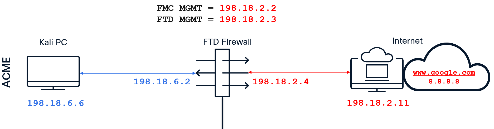

```nginx
INSIDE TO OUTSIDE:
1. ping from 198.18.6.6 to 198.18.6.2 (ACME FTD inside interface)
2. ping from 198.18.6.6 to 198.18.2.11 (ACME Kali PC)
3. ping from 198.18.6.6 to 8.8.8.8
4. ping from 198.18.6.6 to www.google.com

OUTSIDE TO INSIDE
5. ping from 198.18.2.11 or 198.18.2.10 to 198.18.6.6
```

If all five pings succeed, the core lab is done. If any of them fail, start troubleshooting and
continue with the next task.

## Lab login details

| Device | Address | Username | Password |
| --- | --- | --- | --- |
| FMC (ACME site) | `https://198.18.2.2` | `admin` | `dCloud123!` |
| FMC (other site) | `https://198.18.1.2` | `admin` | `Cisco@123` |
| Windows 11 | - | `admin` | `C1sco12345` |
| Kali Linux | - | `kali` | `C1sco12345` |

## Tips for troubleshooting

Work from the endpoint outwards. Most failures in this lab are caused by one of these:

- **On the PC** - wrong IP address, subnet mask, default gateway, or a local firewall blocking ICMP.
- **On the firewall** - missing route, missing ACP rule, or missing NAT rule.

!!! tip "Optional"
    Host a small `index.html` page on the Kali PC so you have HTTP traffic to test with, not just
    ICMP. See [Appendix B](#appendix-b-host-a-test-web-server-on-kali-linux).

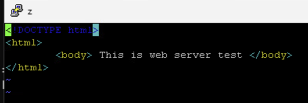

---

## Task 1 - Test connectivity from the LAN-B Kali PC

**Objective:** establish a baseline. Find out exactly which of the five tests pass and which fail
before you change anything.

**Steps**

1. Log in to both Kali PCs highlighted in green in the diagram below.
2. On the **LAN-B Kali PC**, open a terminal.
3. Run each of the following pings and record the result.

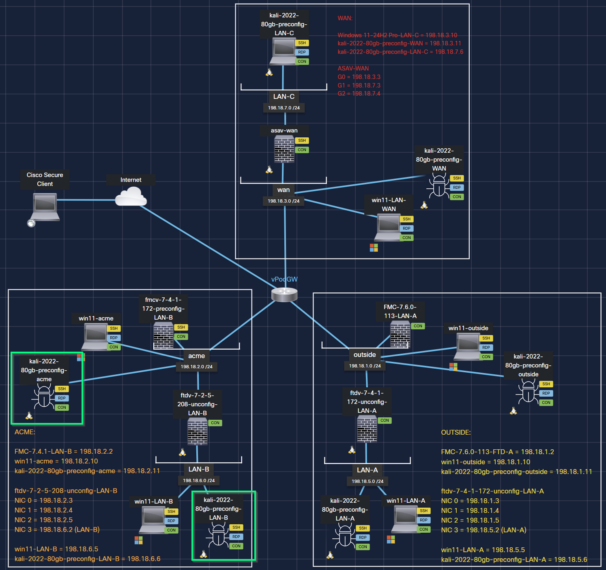

```nginx
1. ping 198.18.6.2 (ACME FTD inside interface)
2. ping 198.18.2.11 (ACME Kali PC)
3. ping 8.8.8.8
4. ping www.google.com
```

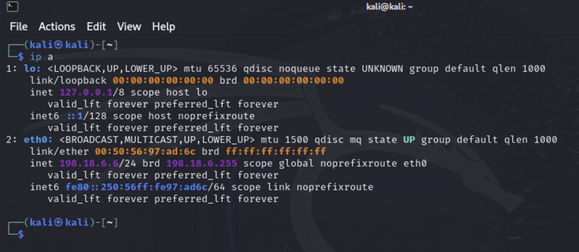

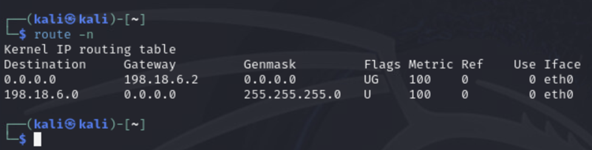

**A. `ping 198.18.6.2` (ACME FTD inside interface)** - this one succeeds. The PC can reach its
default gateway, so the PC addressing and the firewall inside interface are both correct.

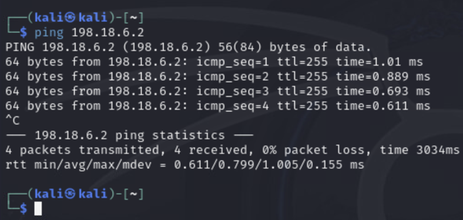

The remaining three tests fail:

```nginx
1. ping 198.18.2.11 (ACME Kali PC)
2. ping 8.8.8.8
3. ping google.com
```

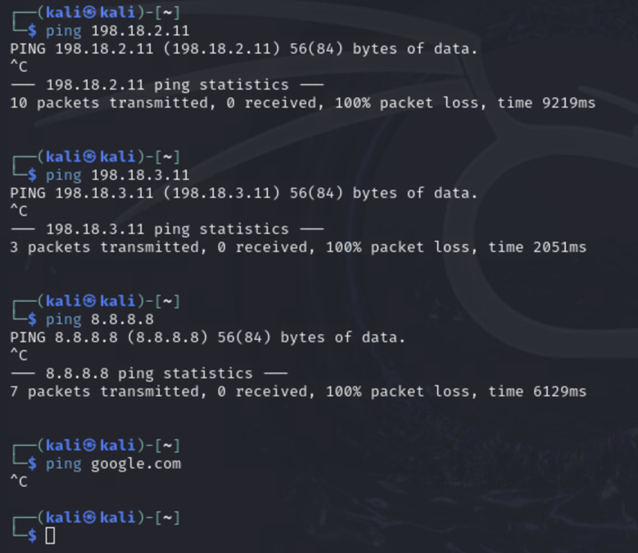

**Expected result:** only the ping to `198.18.6.2` succeeds. Anything that has to cross the
firewall fails. That tells you the problem is on the firewall, not on the PC - which is what
Task 2 confirms.

---

## Task 2 - Find out why the traffic is being dropped

**Objective:** prove where the packet is dropped and why. You will do this first from the FTD CLI,
then repeat the same checks from the FMC GUI.

!!! note
    The CLI section is optional and starts collapsed. Click the heading to open it. Every check
    there can also be done from the FMC web GUI, which is covered in section 2b.

### 2a. Troubleshoot from the FTD CLI (optional) { .collapsed }

SSH to the FTD management address `198.18.2.3`. Use the **win11-acme** Windows PC and PuTTY.

**Check routing** - confirm the firewall has a route towards the destination.

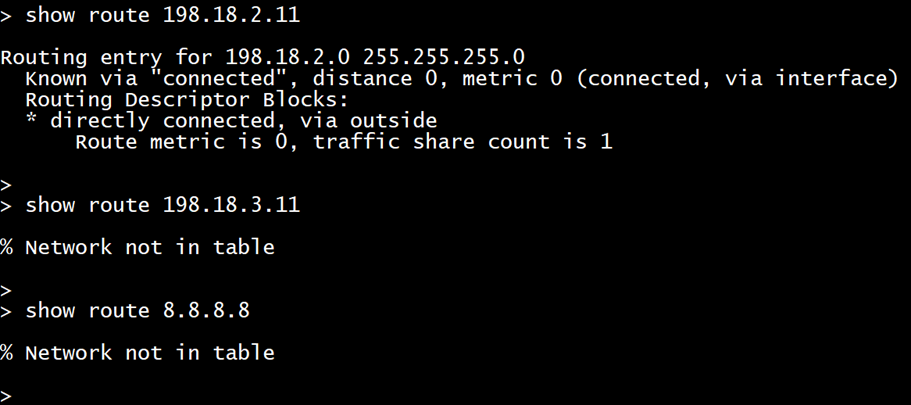

**Run packet-tracer** - this simulates the decision path for a packet without sending real traffic.
Read it top to bottom and look for the phase that returns `DROP`.

```graphql
> packet-tracer input inside icmp 198.18.6.6 8 0 198.18.2.11 detailed 

Phase: 1
Type: ACCESS-LIST
Subtype: 
Result: ALLOW
Elapsed time: 51923 ns
Config:
Implicit Rule
Additional Information:
 Forward Flow based lookup yields rule:
 in  id=0x149ac0317560, priority=1, domain=permit, deny=false
        hits=634, user_data=0x0, cs_id=0x0, l3_type=0x8
        src mac=0000.0000.0000, mask=0000.0000.0000
        dst mac=0000.0000.0000, mask=0100.0000.0000
        input_ifc=inside, output_ifc=any

Phase: 2
Type: ROUTE-LOOKUP
Subtype: No ECMP load balancing
Result: ALLOW
Elapsed time: 22361 ns
Config:
Additional Information:
Destination is locally connected. No ECMP load balancing.
Found next-hop 198.18.2.11 using egress ifc  outside(vrfid:0)

Phase: 3
Type: OBJECT_GROUP_SEARCH
Subtype: 
Result: ALLOW
Elapsed time: 0 ns
Config:
Additional Information:
 Source Object Group Match Count:       0
 Destination Object Group Match Count:  0
 Object Group Search:                   0

Phase: 4
Type: ACCESS-LIST
Subtype: log
Result: DROP
Elapsed time: 303 ns
Config:
access-group CSM_FW_ACL_ global
access-list CSM_FW_ACL_ advanced deny ip any any rule-id 268434432 
access-list CSM_FW_ACL_ remark rule-id 268434432: ACCESS POLICY: Policy_FTD-LAN-B - Default
access-list CSM_FW_ACL_ remark rule-id 268434432: L4 RULE: DEFAULT ACTION RULE
Additional Information:
 Forward Flow based lookup yields rule:
 in  id=0x149ac03e50c0, priority=12, domain=permit, deny=true
        hits=1710, user_data=0x149a930d6c80, cs_id=0x0, use_real_addr, flags=0x0, protocol=0
        src ip/id=0.0.0.0, mask=0.0.0.0, port=0, tag=any, ifc=any
        dst ip/id=0.0.0.0, mask=0.0.0.0, port=0, tag=any, ifc=any,, dscp=0x0, nsg_id=none
        input_ifc=any, output_ifc=any

Result:
input-interface: inside(vrfid:0)
input-status: up
input-line-status: up
output-interface: outside(vrfid:0)
output-status: up
output-line-status: up
Action: drop
Time Taken: 74587 ns
Drop-reason: (acl-drop) Flow is denied by configured rule, Drop-location: frame 0x00005611d409b518 flow (NA)/NA
> 
```

!!! success "What this tells you"
    Routing is fine (Phase 2 found a next hop). The packet is dropped in Phase 4 by the
    **default action rule** of the access control policy - `deny ip any any`. There is no ACP rule
    permitting this traffic.

**Check the accelerated security path drop counters** with `show asp drop`.

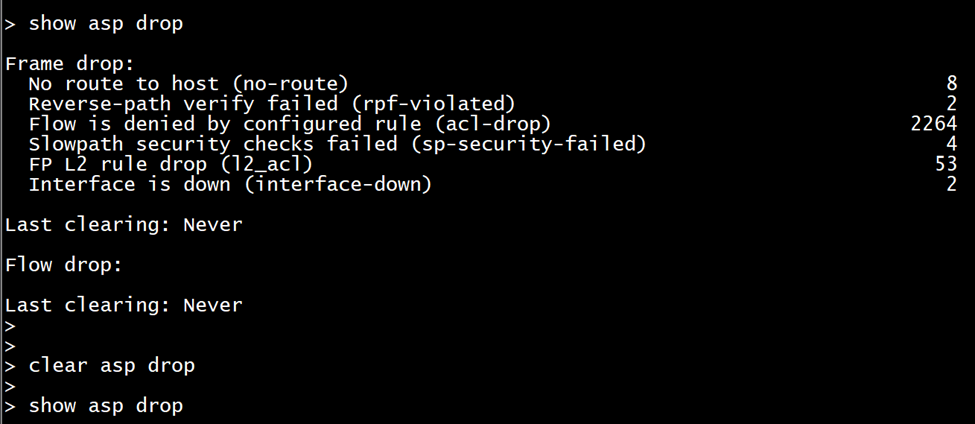

**Take real packet captures** on the inside and outside interfaces. Where the packet appears tells
you what is wrong:

- Seen on inside, not on outside -> ACP is dropping it, or there is a NAT/routing problem.
- Seen on outside with a translated source of `198.18.2.4` -> NAT is working; check the upstream
  device and the return path.
- Replies seen on outside but not on inside -> the return traffic is blocked by the ACP, or you
  have asymmetric routing or an inspection/state issue.

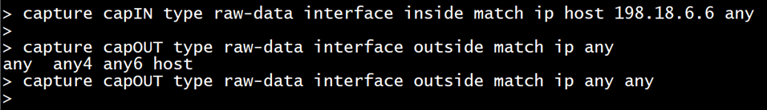

```graphql
capture capIN type raw-data interface inside match ip host 198.18.6.6 any 
> 
> capture capOUT type raw-data interface outside match ip any 
any  any4 any6 host 
> capture capOUT type raw-data interface outside match ip any any 
```

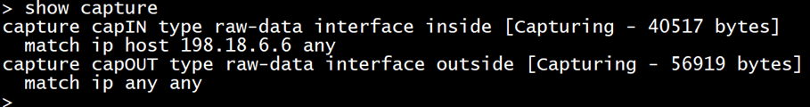

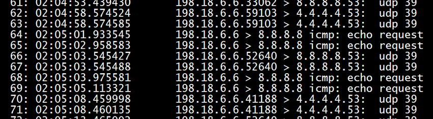

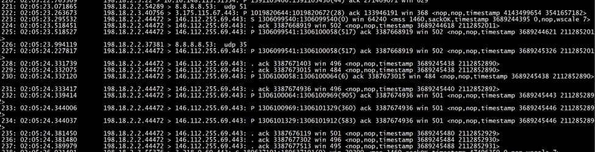

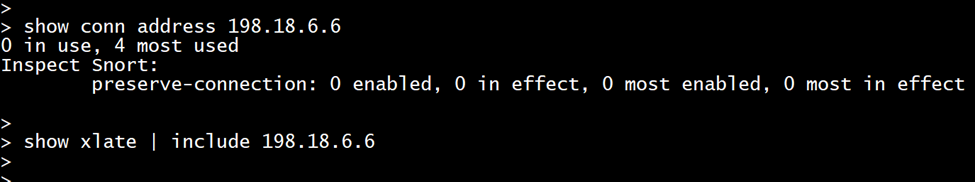

**Check the connection and translation tables.** When traffic is flowing correctly you should see
an active connection and a translated (xlate) entry.

```nginx
show conn address 198.18.6.6
show xlate | include 198.18.6.6
```

**Quick command crib (FTD CLI)**

```graphql
show interface ip brief
show route
show arp
show nat detail
show xlate | include 198.18.6.6
show conn address 198.18.6.6
packet-tracer input inside icmp 198.18.6.6 8 0 8.8.8.8 detailed
capture capIN type raw-data interface inside match ip host 198.18.6.6 any
capture capOUT type raw-data interface outside match ip any any
show capture capIN
show capture capOUT
no capture capIN
no capture capOUT
show asp drop
```

### 2b. Troubleshoot from the FMC GUI

Check the access control policy and NAT configuration. In this lab you should find that:

- The default ACP action is **Block**.
- Logging is **not** enabled on the default action - so nothing is written to the event viewer.
- No ACP rules are configured.
- No NAT rules are configured.

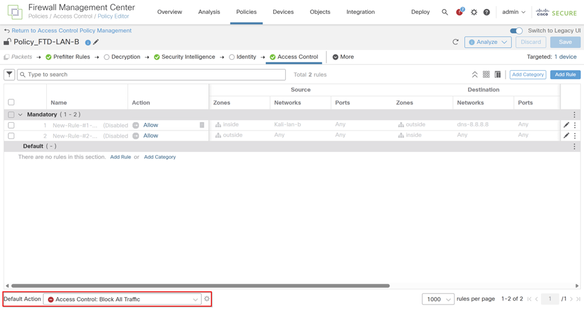

Confirm the default action and its logging setting.

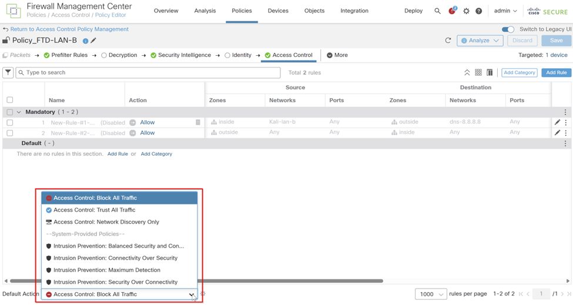

!!! warning
    Enable logging on the default action before you go any further. Without it, blocked traffic
    never appears in the connection events and you will be troubleshooting blind.

**Check the connection events.**

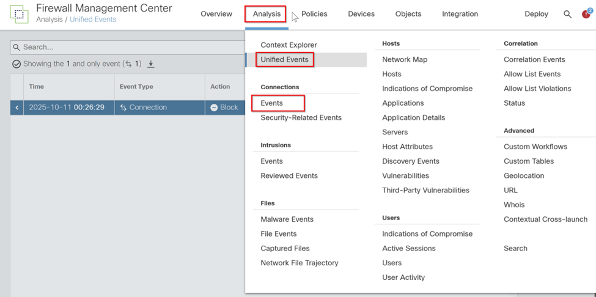

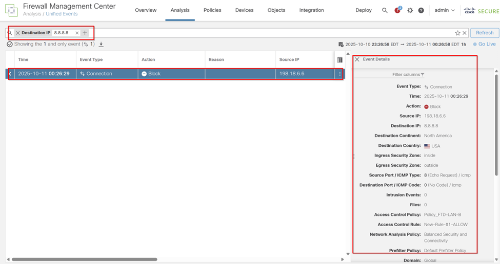

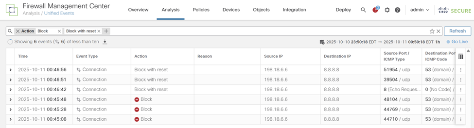

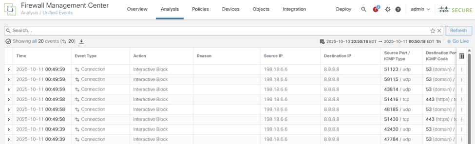

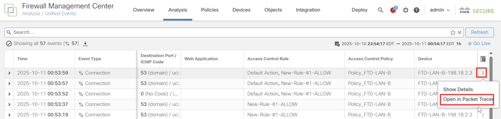

**Enable ACP rule analysis.**

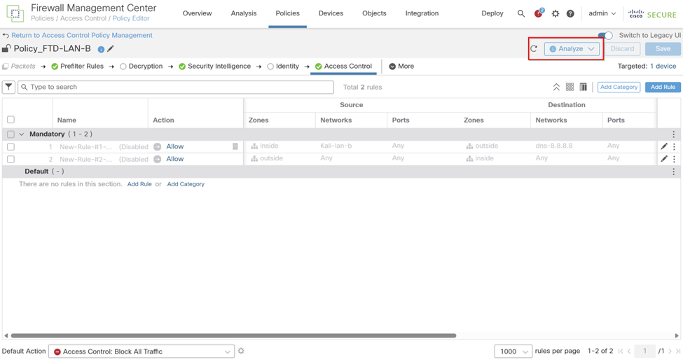

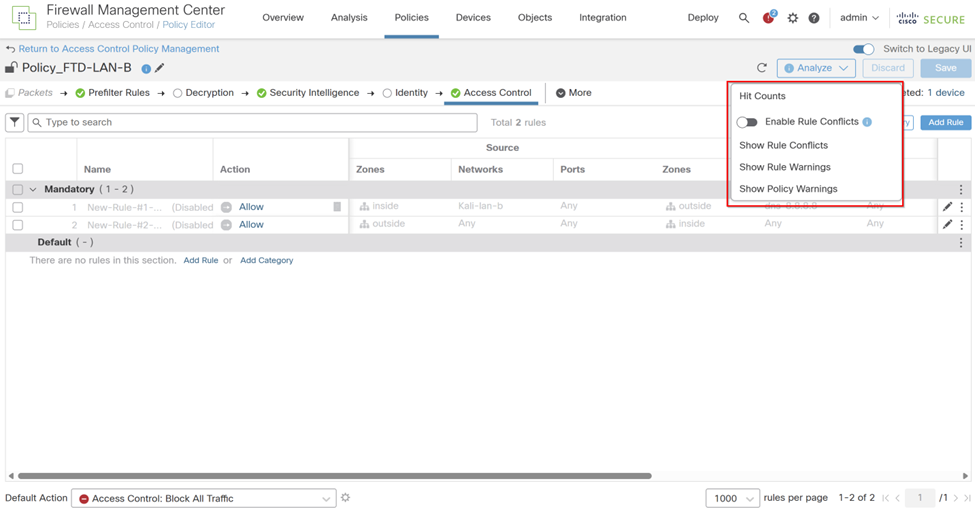

**Show or hide event columns.** Click the **X** to remove a field from the table.

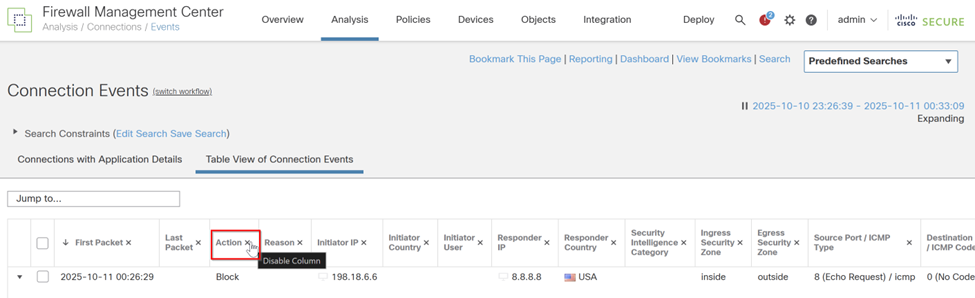

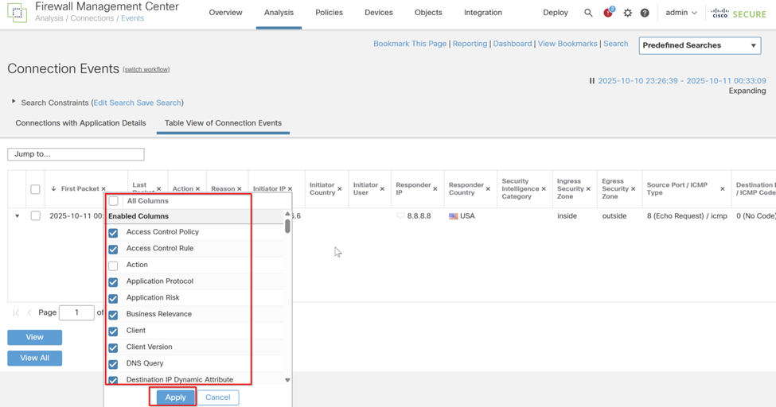

**Advanced search** lets you narrow the events down to the flow you care about.

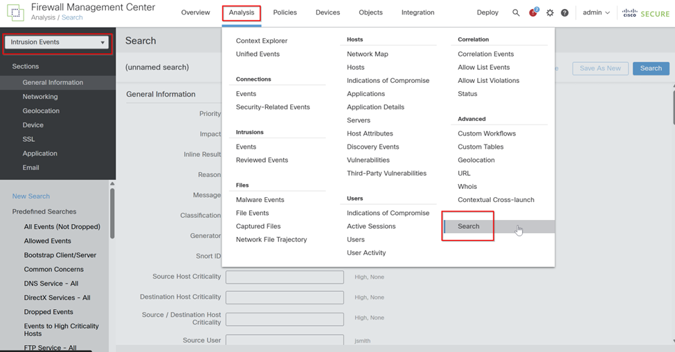

**Run packet-tracer from the GUI** - the same simulation as the CLI, without leaving FMC.

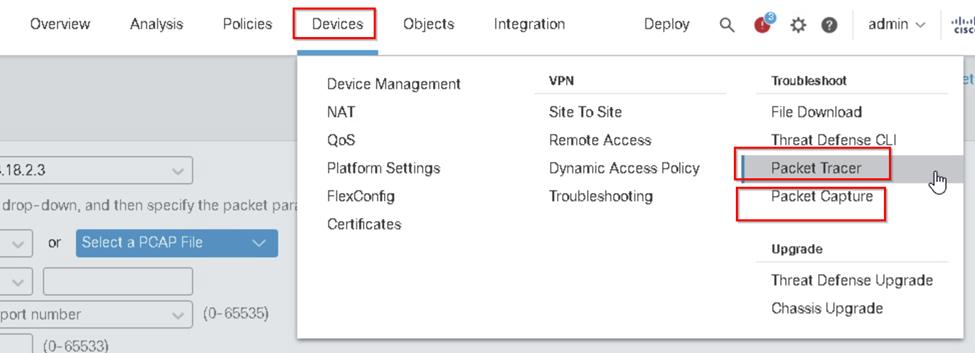

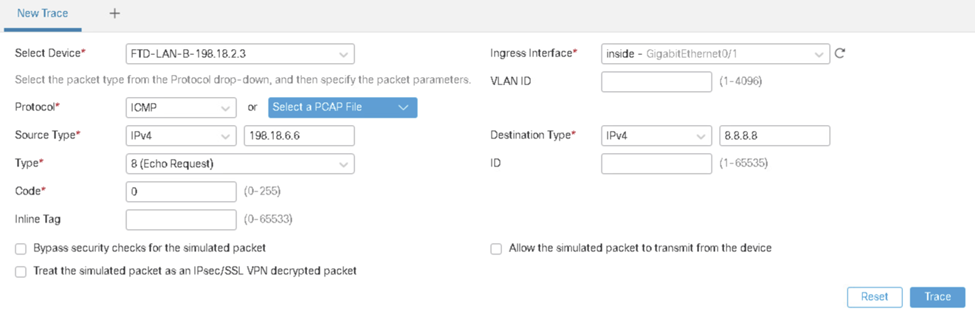

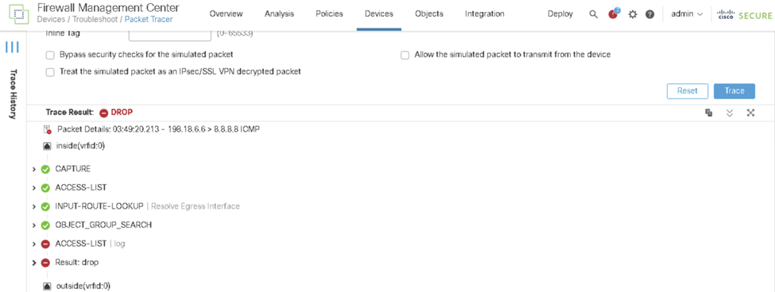

Review the drop and its reason.

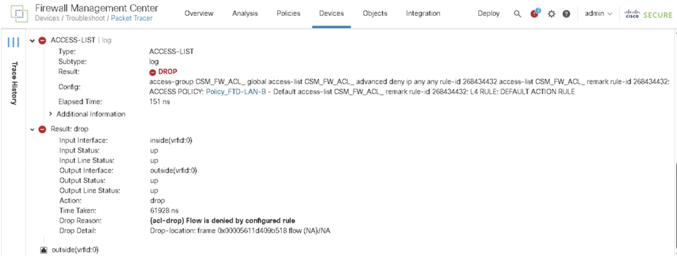

```graphql
Interface: GigabitEthernet0/1
VLAN ID: 
Protocol: ICMP
Source Type: IPv4
Source IP value: 198.18.6.6
Destination Type: IPv4
Destination IP value: 8.8.8.8
ICMP Code: 0
ICMP ID: 
ICMP Type: 8 (Echo Request)
Treat simulated packet as IPsec/SSL VPN decrypt: false
Bypass all security checks for simulated packet: false
Allow simulated packet to transmit from device: false
Select Device: FTD-LAN-B-198.18.2.3
Run trace on all cluster members: false

Device details
Name: FTD-LAN-B-198.18.2.3
Type: Device
ID: cf3467b2-c6e4-11ee-852c-b95da810329f

Phase 1
Elapsed Time: 20087 ns
Type: CAPTURE
ID: 1
Config: 
Result: ALLOW
Additional Information:  Forward Flow based lookup yields rule: in  id=0x149a6cf6fc90, priority=13, domain=capture, deny=false	hits=215, user_data=0x149ac03e98e0, cs_id=0x0, l3_type=0x0	src mac=0000.0000.0000, mask=0000.0000.0000	dst mac=0000.0000.0000, mask=0000.0000.0000	input_ifc=inside, output_ifc=any

Phase 2
Config: Implicit Rule
Elapsed Time: 20087 ns
Type: ACCESS-LIST
ID: 2
Additional Information:  Forward Flow based lookup yields rule: in  id=0x149ac0317560, priority=1, domain=permit, deny=false	hits=8079, user_data=0x0, cs_id=0x0, l3_type=0x8	src mac=0000.0000.0000, mask=0000.0000.0000	dst mac=0000.0000.0000, mask=0100.0000.0000	input_ifc=inside, output_ifc=any
Result: ALLOW

Phase 3
ID: 3
Config: 
Result: ALLOW
Type: INPUT-ROUTE-LOOKUP
Elapsed Time: 21603 ns
Subtype: Resolve Egress Interface
Additional Information: Found next-hop 198.18.2.1 using egress ifc  outside(vrfid:0)

Phase 4
Result: ALLOW
Additional Information:  Source Object Group Match Count:       0 Destination Object Group Match Count:  0 Object Group Search:                   0
Config: 
ID: 4
Elapsed Time: 0 ns
Type: OBJECT_GROUP_SEARCH

Phase 5
Result: DROP
ID: 5
Config: access-group CSM_FW_ACL_ globalaccess-list CSM_FW_ACL_ advanced deny ip any any rule-id 268434432 access-list CSM_FW_ACL_ remark rule-id 268434432: ACCESS POLICY: Policy_FTD-LAN-B - Defaultaccess-list CSM_FW_ACL_ remark rule-id 268434432: L4 RULE: DEFAULT ACTION RULE
Additional Information:  Forward Flow based lookup yields rule: in  id=0x149ac03e50c0, priority=12, domain=permit, deny=true	hits=7633, user_data=0x149a930d6c80, cs_id=0x0, use_real_addr, flags=0x0, protocol=0	src ip/id=0.0.0.0, mask=0.0.0.0, port=0, tag=any, ifc=any	dst ip/id=0.0.0.0, mask=0.0.0.0, port=0, tag=any, ifc=any,, dscp=0x0, nsg_id=none	input_ifc=any, output_ifc=any
Subtype: log
Type: ACCESS-LIST
Elapsed Time: 151 ns

Result
Output Line Status: up
Input Status: up
Drop Detail: Drop-location: frame 0x00005611d409b518 flow (NA)/NA
Input Line Status: up
Time Taken: 61928 ns
Drop Reason: (acl-drop) Flow is denied by configured rule
Output Status: up
Output Interface: outside(vrfid:0)
Action: drop
Input Interface: inside(vrfid:0)
```

**Run a packet capture from the GUI.**

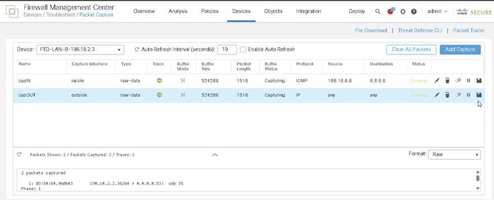

Save the capture file and analyse it in Wireshark.

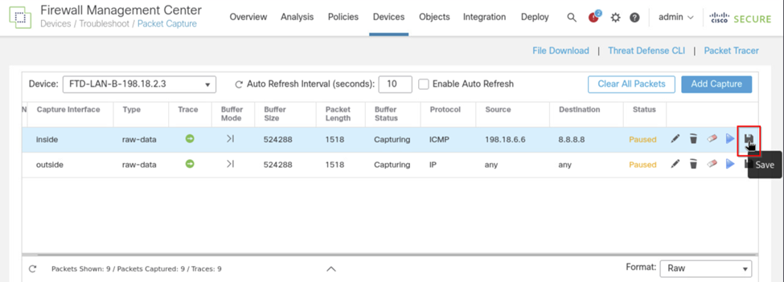

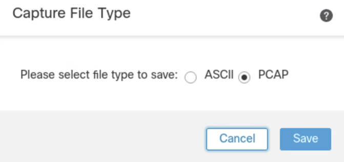

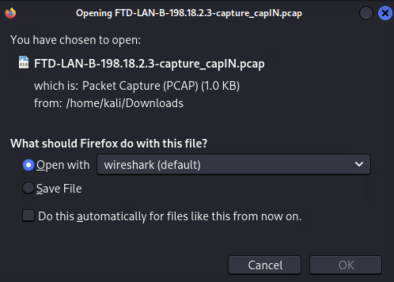

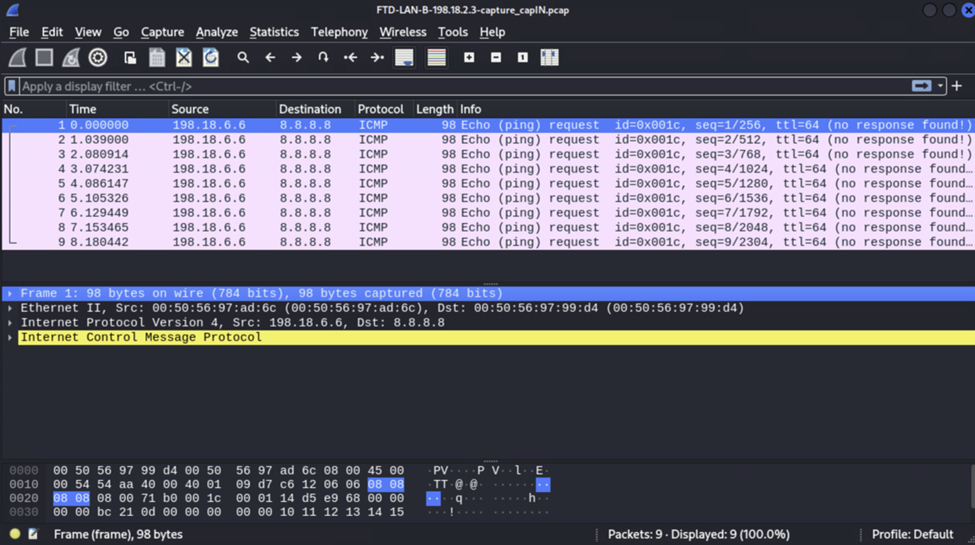

**Expected result:** you can state, with evidence, that the traffic is dropped by the ACP default
action and that no NAT rule exists for the inside network.

---

## Task 3 - Allow traffic from inside `198.18.6.6` to outside `8.8.8.8`

**Objective:** create the ACP and NAT rules that let LAN-B reach the outside network and the
internet, then prove the change worked.

**Steps**

1. Log in to FMC at `https://198.18.2.2` (`admin` / `dCloud123!`).
2. Check the interface IP addresses, routing and security zones.
3. Create the required ACP rule and NAT rule.

Go to **Policies > Access Control** and add a rule permitting inside to outside.

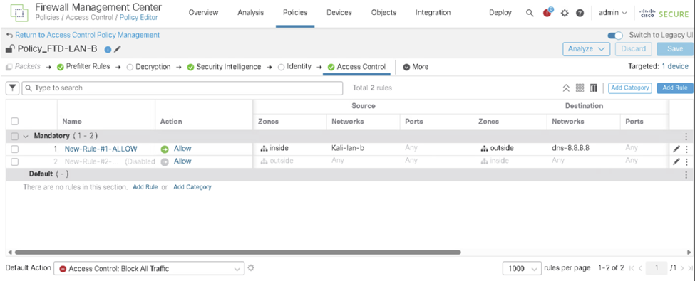

Go to **Devices > NAT** and add the translation for the inside network.

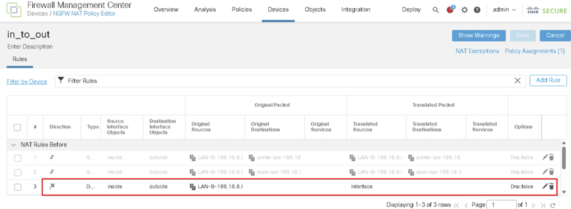

!!! warning "Save and deploy"
    Configuration changes do nothing until they are deployed to the device. Save your changes, then
    deploy. For this lab you can select **Ignore warning**.

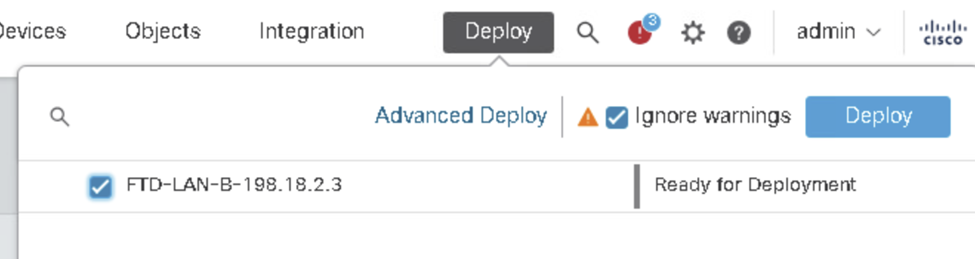

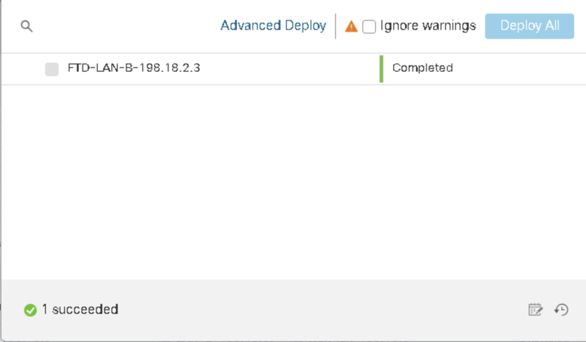

Check the packet captures again to see the difference.

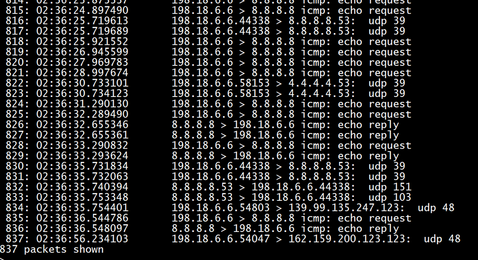

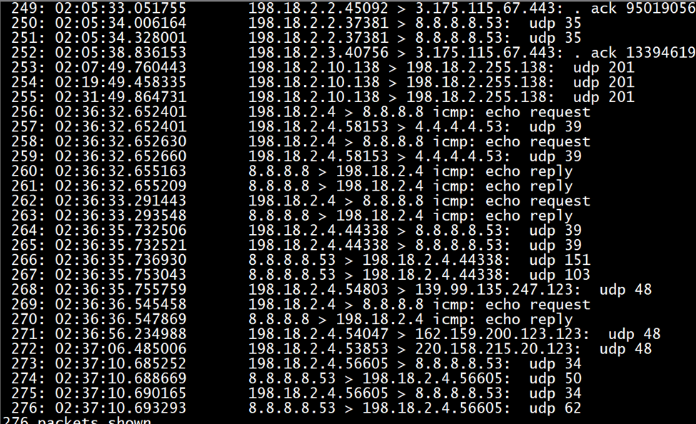

!!! danger "Always stop your captures"
    Captures consume memory and CPU on the firewall. Remove them as soon as you have finished
    troubleshooting.

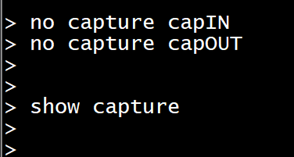

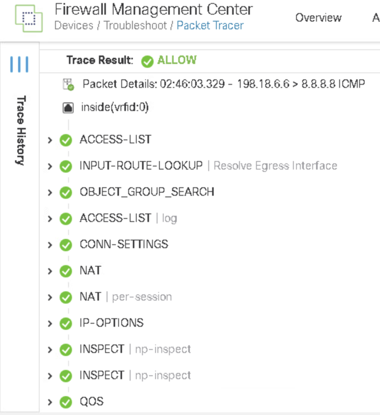

Re-run the tests from the LAN-B Kali PC.

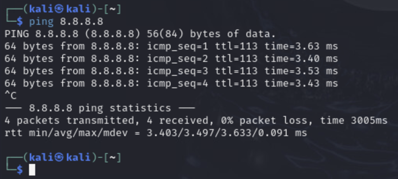

**Expected result:** tests 1 to 4 from the success criteria now pass.

---

## Task 4 - Allow traffic from outside `198.18.2.x` to inside `198.18.6.x`

**Objective:** allow the return direction. By default neither the Kali PC nor the Windows PC on the
outside network can ping or connect to the `198.18.6.0/24` network.

**Steps**

1. On the outside **Kali PC**, check the IP address, mask, gateway and routing, then ping
   `198.18.6.6`.

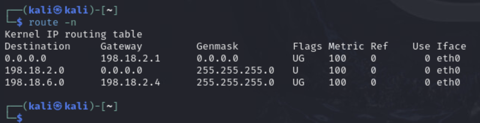

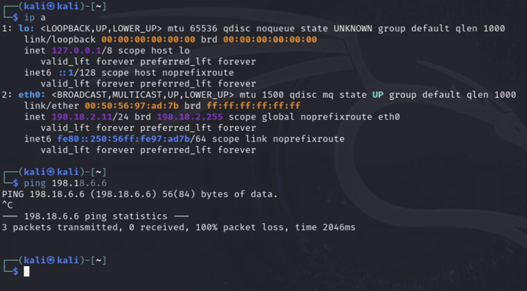

2. On the outside **Windows PC**, do the same checks and the same ping.

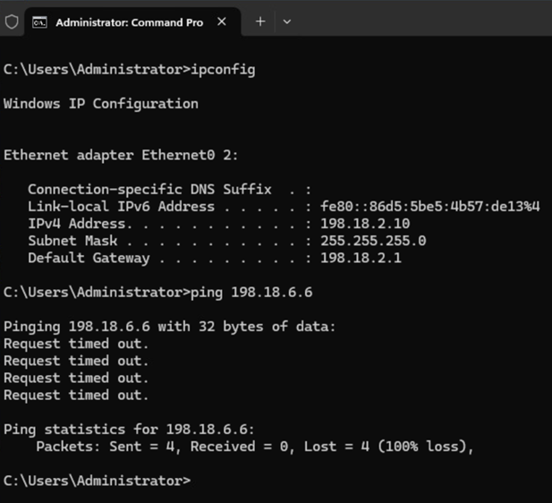

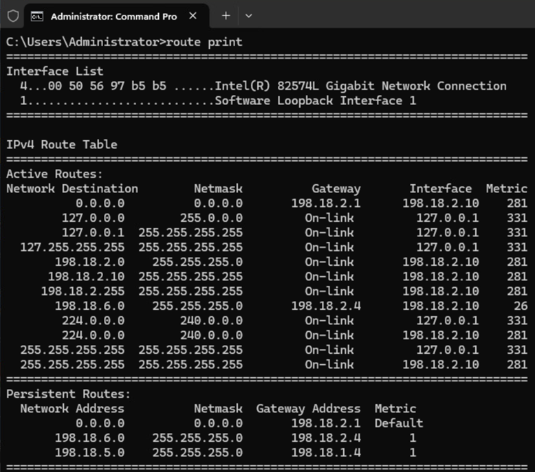

3. Configure the ACP and NAT rules needed to allow this traffic.

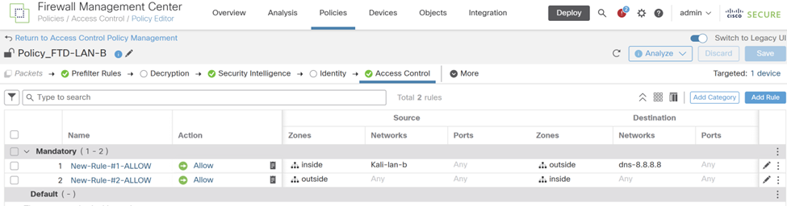

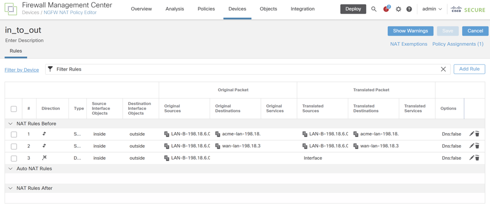

4. Deploy the changes and run the tests again.


**Expected result:** test 5 from the success criteria now passes. The core lab is complete.

---

## Task 5 - Create and test an IPS policy

**Objective:** build an intrusion policy that blocks ICMP, attach it to an ACP rule, and confirm
from the events that it is taking effect.

**Steps**

1. Create an intrusion policy and add a rule that blocks ICMP traffic.


2. Apply the intrusion policy to an ACP rule.


3. Deploy the changes.
4. Generate ICMP traffic between the inside and outside interfaces.
5. Check the events under **Connection Events** or **Unified Events**.


**Expected result:** the pings that worked in Task 3 are now blocked, and each block is visible as
an intrusion event.

---

## Task 6 - Build a site-to-site VPN between the two sites

**Objective:** configure an IPsec site-to-site VPN so that `198.18.5.0/24` and `198.18.6.0/24` can
reach each other. You must configure **both** ends before the tunnel comes up.

**Site details**

```nginx
1. OUTSIDE
   Firepower FTD = 198.18.1.4
   Encrypted traffic = 198.18.5.0/24

2. ACME
   Firepower FTD = 198.18.2.4
   Encrypted traffic = 198.18.6.0/24
```

| Device | Address | Username | Password |
| --- | --- | --- | --- |
| FMC (other site) | `https://198.18.1.2` | `admin` | `Cisco@123` |
| Windows 11 | - | `admin` | `C1sco12345` |
| Kali Linux | - | `kali` | `C1sco12345` |


**Success criteria for this task**

```nginx
1. ping from 198.18.6.6 to 198.18.5.6
2. ping from 198.18.5.6 to 198.18.6.6
```

### 6a. Configure the ACME end (FMC `198.18.2.2`)


The tunnel status shows as **Unknown** at this point, because the remote end is not configured yet.


Add an ACP rule that permits the VPN traffic.


Add the NAT rules, including a NAT exemption so the VPN traffic is not translated.


!!! note
    The VPN only shows as **Active** once the remote site has been configured as well.


Test from the Kali PC.


Verify the tunnel from the FTD CLI (`198.18.2.3`).


Verify the tunnel from FMC.


### 6b. Configure the other end (FMC `198.18.1.2`)

Repeat the same configuration on the second FMC. Until it is deployed, this end also shows an
**Unknown** status.


Test from the Kali PC at this site.


Verify the tunnel from the FTD CLI (`198.18.1.3`).


Review the events.


Verify the tunnel from FMC.


**Expected result:** the tunnel is **Active** at both ends and both pings succeed.

---

## Task 7 - Block a file download with a file policy

**Objective:** use a Secure Firewall file policy to block a file download, and confirm the block
from both the web server logs and the firewall logs.

**Scenario:** the Kali PC at `198.18.6.6` tries to download a blocked file type from the web server
at `198.18.2.11`.

!!! note "Preparation"
    Host a web server on the Kali PC at `198.18.2.11` using the Python web server module shown in
    [Appendix B](#appendix-b-host-a-test-web-server-on-kali-linux), and place a test `.jpg` file in
    the folder you serve from.


**Steps**

1. Create the file policy in Secure Firewall.


2. Start the web server on the Kali PC.


3. From the client, try to download the file.


4. Check the web server logs.


5. Check the Secure Firewall logs.


**Expected result:** the download fails on the client, the web server shows the request, and FMC
records a file event showing the block.

---

## Appendix A - Capture traffic on Kali Linux with tcpdump

Capture specific traffic between two hosts.


Capture any traffic between two hosts.


## Appendix B - Host a test web server on Kali Linux


