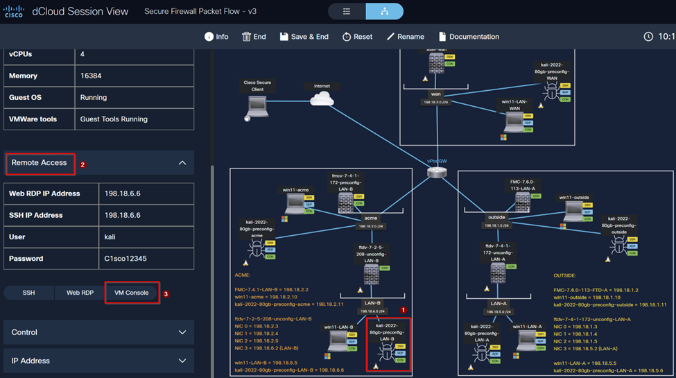
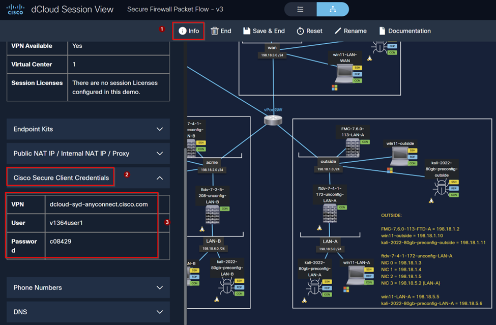
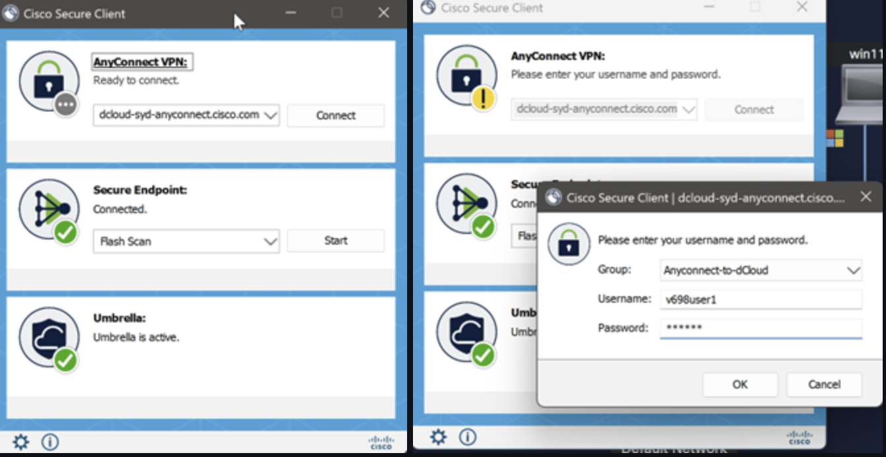

# Prepare the Lab Environment

This scenario describes how to set up and access all the devices in this lab environment so that it supports subsequent scenarios and tasks.  

## How to access lab devices via Web Browser 
1.	On the dCloud topology page, click the LAN-B Kali PC icon. Then, on the left-hand side, please go to remote access and click the VM console option to access this Ubuntu workstation GUI.  

  

## How to access lab devices using VPN 
NOTE: If the browser-based GUI is not working, you can connect directly to the lab using the Cisco Secure Client. Once you are connected to the Secure Client remote access VPN, you can use your workstation to SSH into the lab or access the lab IPs directly via a web browser. Please refer to the info tab below for the details on using the lab remote access VPN.  

  

  

    

