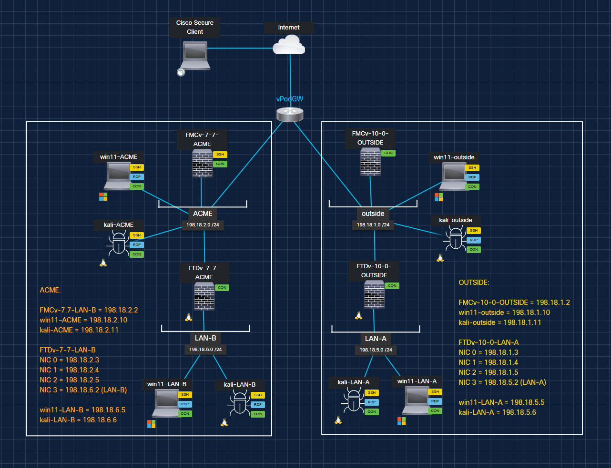
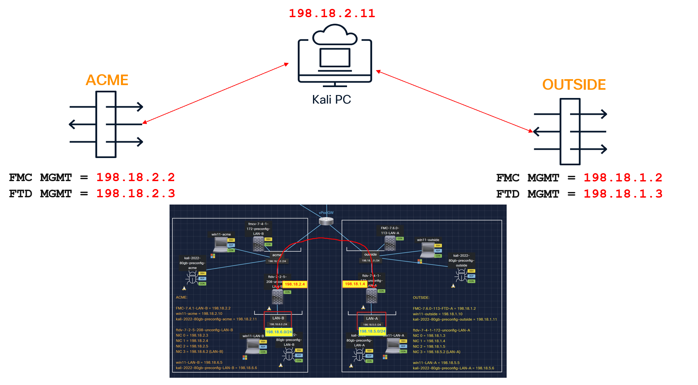
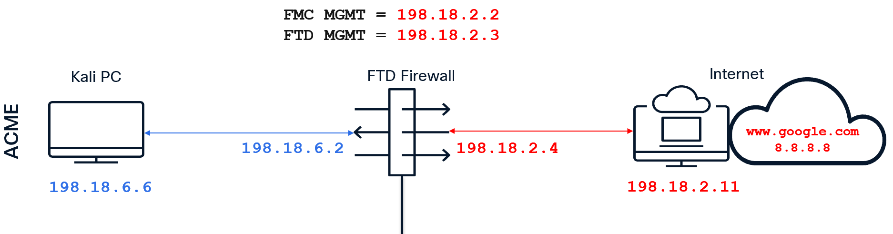
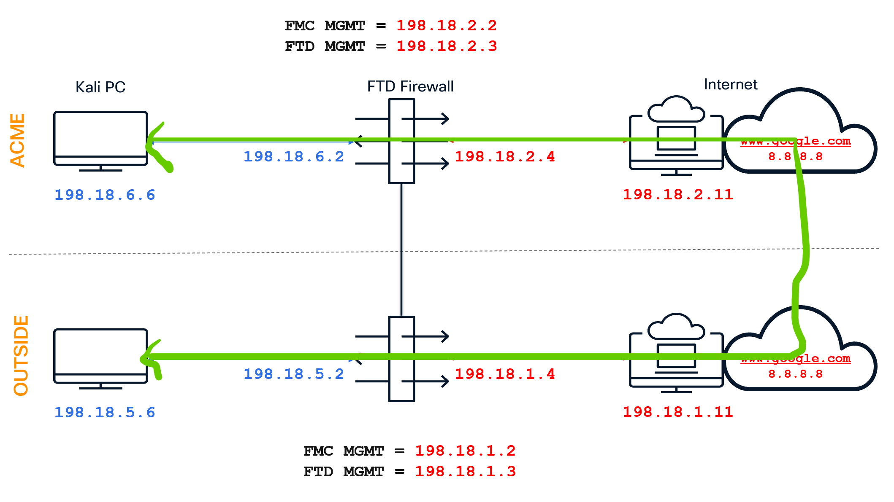
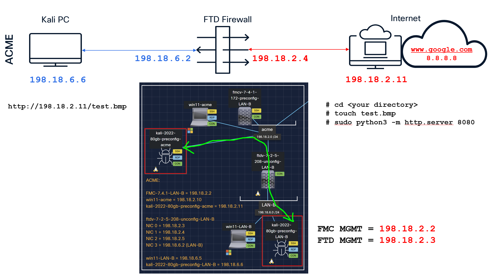

# dcloud Lab topology { .blue-heading }
<figure markdown>
  
</figure>

# Manage both FMCs { .blue-heading }

# Task 1 to 5 toplogy { .blue-heading }

# Site to Site VPN topology { .blue-heading }

# File Policy topology { .blue-heading }

